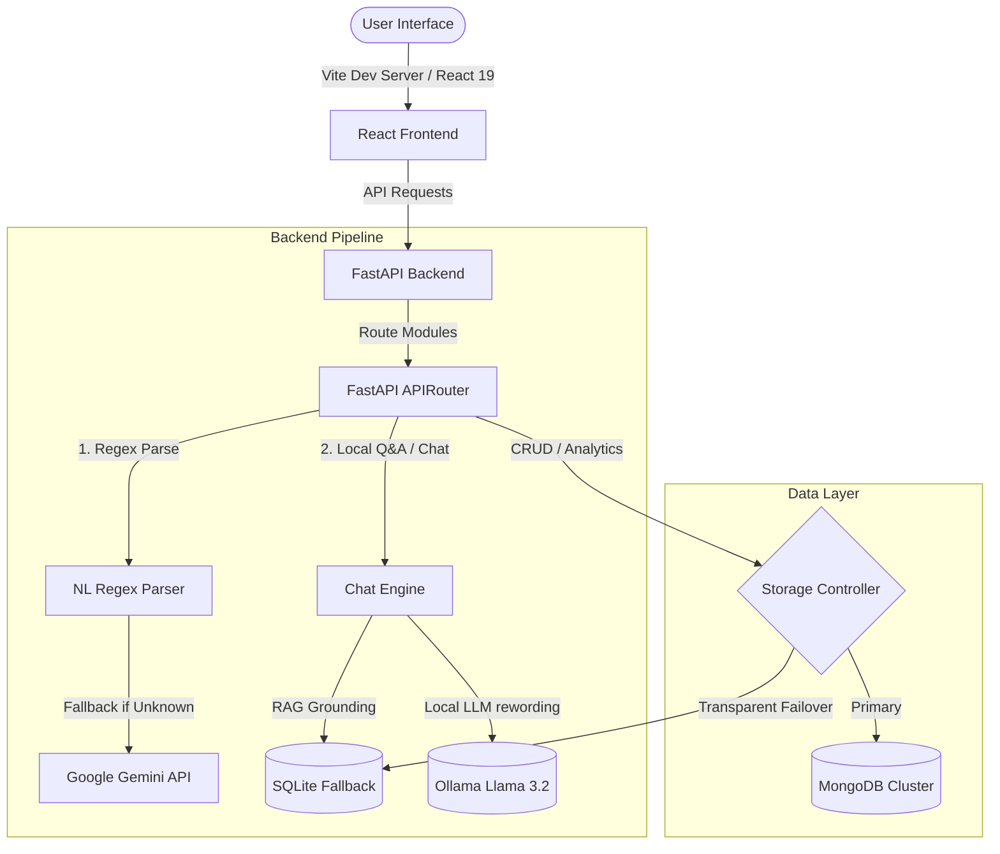

# Batua — Intelligent Personal Finance Manager

[](https://github.com/anshuldhiman-ai/Batua/actions)
[](https://www.python.org)
[](https://nodejs.org)
[](https://vitejs.dev)
[](https://sqlite.org)

**Batua** (meaning *wallet* in Hindi) is a privacy-focused, intelligent personal finance manager designed for local use. It features a sleek glassmorphic SaaS interface and pairs a dual regex-LLM parsing pipeline with a local ML-powered conversational assistant to turn unstructured financial entries into structured insights.

<p align="center">
  <video src="demo.gif.mp4" width="100%" style="max-width: 800px; border-radius: 12px; border: 1px solid rgba(255,255,255,0.1);" controls autoplay loop muted></video>
</p>

---

## 🏗️ System Architecture

Batua is built with a decoupled architecture designed for high availability and low latency on local environments:



---

## 🚀 Key Architectural Highlights

This project was built to showcase production-grade software engineering patterns and practical machine learning applications:

### 1. Transparent Storage Failover (Dual-DB Engine)
* **Design Pattern**: Controller-Abstraction pattern.
* **Mechanism**: On startup, Batua pings the configured **MongoDB** instance. If unreachable within a `1500ms` window, it performs a seamless, hot failover to a **SQLite** database (`backend/data/store.db`) running async WAL journaling via `aiosqlite`. Both engines adhere to an identical async interface, ensuring zero application downtime.

### 2. $O(1)$ Optimized Dashboard Caching
* **Optimization**: The default dashboard metrics endpoint previously iterated over transactions lists multiple times ($O(N)$ complexity).
* **Fix**: Batua now buckets transactions by month in a single pass (`pre_bucket_transactions`) and utilizes an in-memory TTL caching layer (`app/cache.py`). Cache invalidation is bound to database mutation triggers, ensuring users always see real-time, low-latency metrics.

### 3. Local-First Conversational Assistant (RAG Engine)
* **Mechanisms**: Includes a multi-turn chat assistant featuring conversational state memory, follow-up resolution, and query grounding.
* **LLM Integration**: Processes financial query results, wraps them in strict context grounding blocks, and routes them to a local **Ollama** instance (`llama3.2`) to synthesize user replies offline—eliminating data leaks or API subscription costs.

### 4. Hybrid Natural Language Parsing Pipeline
* Parses inputs like `zomato 450 yesterday upi` instantly using a local Regex-NLP heuristic pipeline.
* Gracefully falls back to the **Google Gemini API** (`gemini-2.5-flash`) for complex syntax patterns or semantic edge cases.

---

## 🎨 User Interface & Experience

Batua features a responsive dark-themed dashboard styled with HSL variables, fluid custom keyframe animations, and Radix accessibility roles:
* **Natural-Language Hero Bar**: Type or use voice dictation to speak transactions.
* **Dynamic Analytics Tabbed Suite**: Includes spending timelines, category breakdowns, merchant charts, treemaps, and a GitHub-style calendar heatmap.
* **Budget Allocator**: Set limits per category and track health through Rose/Amber progress indicators.
* **AI Insights Companion**: Floating widget providing instant financial health analysis.

<p align="center">
  
  
  
</p>

---

## 📦 Tech Stack

* **Backend**: FastAPI, `uvicorn`, `motor` (Async MongoDB), `aiosqlite` (Async SQLite), `pydantic` v2, `pandas`/`openpyxl` (Excel processing), `google-generativeai` SDK.
* **Frontend**: React 19, React Router 7, Vite (ESM modular bundler), Tailwind CSS v3, Recharts, Radix UI Primitives, Lucide Icons, Sonner.
* **AI/ML**: Ollama (`llama3.2`), Google Gemini API, Regex Parser.

---

## 🔧 Prerequisites

* **Python 3.11+**
* **Node.js 18+**
* **Ollama** (optional, for local chatbot support)
* **MongoDB** (optional, transparent SQLite failover works out of the box)

---

## ⚙️ Configuration

Copy `.env.example` to `.env` at the root folder:

```bash
# Storage config
MONGO_URL="mongodb://localhost:27017"
DB_NAME="batua"
CORS_ORIGINS="*"

# LLM APIs
GOOGLE_API_KEY="AIzaSy..." # Optional: fallbacks to local rule-base if empty
GEMINI_MODEL="gemini-2.5-flash"

# Local Q&A Chatbot config
LOCAL_LLM_URL="http://localhost:11434"
LOCAL_LLM_MODEL="llama3.2"
LOCAL_LLM_ENABLED=1
```

---

## 🏃 Quick Start

### 1. Clone & Set Up Backend
```bash
cd backend
pip install -r requirements.txt
python -m uvicorn server:app --host 0.0.0.0 --port 8001 --reload
```
The backend API runs at `http://localhost:8001`.

### 2. Set Up Frontend
```bash
cd frontend
corepack enable
yarn install
yarn dev
```
The Vite development server launches at `http://localhost:3000`.

*Windows shortcut: Double-click `run-backend.bat` and `run-frontend.bat` to launch both services instantly.*

---

## 📂 Project Structure

```
batua/
├── backend/
│   ├── server.py              # Main app entry, lifespan context, CORS middlewares
│   ├── storage.py             # Dual Mongo/SQLite storage wrapper
│   ├── ai.py                  # Gemini API wrapper with safe fallbacks
│   ├── local_llm.py           # Ollama client and multi-turn message compiler
│   ├── chat_engine.py         # Chat state tracking and intent-routing layer
│   ├── parser.py              # Regex NLP parse pipeline
│   ├── app/
│   │   ├── models.py          # Strict Pydantic database and API models
│   │   ├── helpers.py         # Global backend helper modules
│   │   ├── cache.py           # In-memory TTL metrics cache
│   │   └── routes/            # Decoupled FastAPI router controllers
│   └── tests/                 # Full unit test suite (Ruff & Pytest validation)
├── frontend/
│   ├── index.html             # Vite root entry
│   ├── vite.config.js         # Path aliases & api proxy rules
│   ├── src/
│   │   ├── main.jsx           # React app renderer
│   │   ├── App.jsx            # Suspense-wrapped router & context providers
│   │   ├── components/        # Layout, NLInputBar, charts, Radix dialogs
│   │   └── pages/             # Dashboard, Analytics, Budgets, Settings
```

---

## 🧪 Testing and CI

The codebase is automatically formatted, linted, and unit-tested on every commit:
```bash
# Run backend code checks
cd backend
ruff check .
pytest tests/ -v

# Run frontend build check
cd frontend
yarn build
```

---

## 🔒 Security & Scope

Batua is **designed for single-user local deployment**. 
* Access tokens, HTTPS/SSL, and multi-tenant isolation are excluded by design to focus strictly on local performance, user privacy, and zero server infrastructure overhead.
* If deploying to public instances, it is highly recommended to wrap routes in an OAuth2 proxy.
