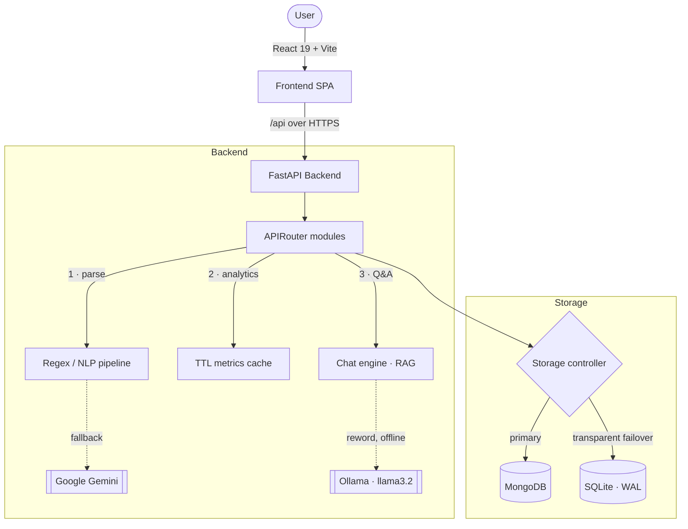

# Batua — Intelligent Personal Finance Manager

[](https://github.com/anshuldhiman-ai/Batua/actions)
[](https://www.python.org)
[](https://fastapi.tiangolo.com)
[](https://react.dev)
[](https://www.typescriptlang.org)
[](https://vitejs.dev)
[](https://sqlite.org)
[](#-license)

> **Batua** (*wallet*, in Hindi) is a privacy-first personal finance manager. Type an expense in plain English — `zomato 450 yesterday upi` — and Batua parses, categorises, stores, and visualises it. A local LLM answers questions about your money **entirely offline**, so nothing sensitive ever has to leave your machine.

<p align="center">
  <video src="demo.gif.mp4" width="100%" style="max-width: 820px; border-radius: 12px; border: 1px solid rgba(255,255,255,0.1);" controls autoplay loop muted></video>
</p>

---

## Table of Contents

- [Why Batua](#-why-batua)
- [Feature Overview](#-feature-overview)
- [System Architecture](#-system-architecture)
- [Engineering Highlights](#-engineering-highlights)
- [Tech Stack](#-tech-stack)
- [Quick Start](#-quick-start)
- [Configuration](#-configuration)
- [API Surface](#-api-surface)
- [Project Structure](#-project-structure)
- [Testing & CI](#-testing--ci)
- [Security](#-security)
- [Deployment](#-deployment)
- [License](#-license)

---

## ✨ Why Batua

| | |
|---|---|
| 🧠 **Natural-language first** | Log transactions the way you'd text a friend. A local regex/NLP pipeline handles the common cases instantly, with an optional Gemini fallback for messy input. |
| 🔒 **Private by default** | Your data lives on your machine. The conversational assistant runs on a **local** Ollama model — zero cloud calls, zero subscription, zero data egress. |
| ♻️ **Zero-config storage** | Ships with MongoDB support but transparently fails over to an embedded SQLite database. Clone, run, done — no database to provision. |
| 📊 **Insight-dense** | Timelines, category breakdowns, merchant analysis, treemaps, a calendar heatmap, budget health, cash-flow forecasting, and anomaly detection out of the box. |
| ⚡ **Fast** | Single-pass metric bucketing and a TTL cache keep the dashboard sub-100ms even as transaction volume grows. |

---

## 🎯 Feature Overview

### Capture
- **Natural-language entry** — `swiggy 320 upi`, `salary 85000 credit`, parsed into structured transactions.
- **Bulk & voice input** — paste multiple lines or dictate; each line is parsed independently.
- **Recurring entries** — replicate a transaction across selected months in one action, with idempotent de-duplication.
- **Excel / CSV import** — column auto-detection, staged progress reporting, 25 MB guard, and fingerprint-based dedupe on re-upload.

### Understand
- **Analytics suite** — spending timelines, category breakdowns, top merchants, payment-method mix, treemaps, and a GitHub-style calendar heatmap.
- **Dashboard KPIs** — income, expense, net, and savings-rate with month-over-month deltas.
- **Budgets** — per-category limits with live health indicators.
- **AI insights** — instant rule-based coaching, optionally reworded by a local or cloud LLM for a natural tone.
- **ML features** — cash-flow forecasting, spending-pattern clustering, budget optimisation, savings recommendations, and anomaly detection (scikit-learn).

### Ask
- **Conversational assistant** — a grounded Q&A engine with multi-turn session memory and follow-up resolution ("what about last month?"). Answers are computed from *your* data, then optionally reworded by a local Llama model.

### Export
- One-click **CSV** and **Excel** export of all transactions.

---

## 🏗 System Architecture

A decoupled frontend/backend split, built for low latency and offline operation.



---

## 🔬 Engineering Highlights

### 1 · Transparent dual-database failover
On startup the storage controller pings MongoDB with a 1.5 s budget. If it's unreachable, Batua hot-fails-over to an async SQLite store (`aiosqlite`, WAL journaling). **Both backends implement the identical async interface** (`all / get / insert / update / delete / …`), so not a single route knows or cares which engine is live. Result: the app runs with zero setup on any machine, and scales up to Mongo Atlas by setting one env var.

### 2 · Single-pass analytics with cache invalidation
Dashboard and analytics endpoints bucket transactions by month in a **single pass** and serve from an in-memory TTL cache (`app/cache.py`). Every write path calls `invalidate_analytics_cache()`, binding cache lifetime to data mutations — so metrics are always fresh *and* fast.

### 3 · Local-first RAG assistant
The Q&A engine computes verified figures from your transactions, wraps them in a strict grounding prompt that **forbids inventing numbers**, and routes them to a local Ollama model for natural phrasing. If Ollama isn't running, it degrades gracefully to deterministic templates. No data leaves the device; no API bill.

### 4 · Hybrid NLP parsing that fails soft
A local regex + heuristic pipeline resolves the vast majority of entries instantly. Only genuinely ambiguous input falls through to Gemini — and if no key is configured, the rule-based parser still returns a best-effort result. Every external dependency in the app is *optional* and *degradable*.

### 5 · Production hardening
Security headers on every response, environment-gated API docs, sanitised error responses with correlation IDs, and content-fingerprint idempotency on imports. See [Security](#-security).

---

## 🧰 Tech Stack

| Layer | Technologies |
|---|---|
| **Backend** | FastAPI · Uvicorn · Pydantic v2 · Motor (async MongoDB) · SQLModel + aiosqlite · Pandas / openpyxl / XlsxWriter |
| **AI / ML** | Ollama (`llama3.2`) · Google Gemini (`gemini-2.5-flash`) · scikit-learn · spaCy · custom regex NLP |
| **Frontend** | React 19 · TypeScript · Vite 6 · React Router 7 · TanStack Query · Tailwind CSS 3 · Recharts · Framer Motion · Axios · react-dropzone · Lucide · Sonner |
| **Tooling** | Ruff · Pytest (+ pytest-asyncio) · GitHub Actions CI |

---

## 🚀 Quick Start

**Prerequisites:** Python 3.11+, Node.js 18+. MongoDB and Ollama are both **optional**.

### Backend

```bash
cd backend
pip install -r requirements.txt
python -m uvicorn server:app --host 0.0.0.0 --port 8001 --reload
```
API runs at **http://localhost:8001** (health check: `GET /api/`).

### Frontend

```bash
cd frontend
corepack enable        # provides yarn
yarn install
yarn dev
```
The Vite dev server launches at **http://localhost:3000** and proxies `/api` to the backend.

> 💡 **Windows shortcut:** double-click `run-backend.bat` and `run-frontend.bat` (or `run-all.bat`) to launch everything.

### Optional: enable the offline chat assistant

```bash
# https://ollama.com/download
ollama pull llama3.2   # ~2 GB, runs on CPU
```
Batua auto-detects Ollama on `localhost:11434`. If it's absent, the assistant falls back to deterministic templates.

---

## ⚙️ Configuration

Copy `.env.example` → `.env` in the project root (shared by backend and frontend):

```bash
# ── Storage ───────────────────────────────────────────────
MONGO_URL="mongodb://localhost:27017"   # falls back to SQLite if unreachable
DB_NAME="batua"

# ── Security ──────────────────────────────────────────────
CORS_ORIGINS="*"        # LOCAL only — set to your frontend URL in production
ENABLE_DOCS="0"         # set "1" to expose /docs, /redoc, /openapi.json

# ── Cloud LLM (optional) ──────────────────────────────────
GOOGLE_API_KEY=""       # empty → rule-based parser only
GEMINI_MODEL="gemini-2.5-flash"

# ── Local LLM (optional, recommended) ─────────────────────
LOCAL_LLM_URL="http://localhost:11434"
LOCAL_LLM_MODEL="llama3.2"
LOCAL_LLM_ENABLED="1"

# ── Frontend (Vite) ───────────────────────────────────────
VITE_BACKEND_URL="http://localhost:8001"
```

> ⚠️ **Rotate any key that has ever lived in a local `.env` before deploying or sharing this repo.** `.env` is git-ignored, but the value still sits in plaintext on disk. Generate a fresh `GOOGLE_API_KEY` at <https://aistudio.google.com/app/apikey> and revoke the old one.

---

## 🔌 API Surface

All routes are mounted under `/api`. Highlights:

| Group | Routes |
|---|---|
| **Transactions** | `GET/POST /transactions` · `PUT/DELETE /transactions/{id}` · `POST /transactions/bulk` · `bulk-delete` · `recurring` |
| **Analytics** | `/analytics/timeline` · `category-breakdown` · `top-merchants` · `heatmap` · `payment-method` · `treemap` |
| **Dashboard** | `GET /dashboard/metrics` |
| **Budgets** | `GET/POST /budgets` · `DELETE /budgets/{id}` · `GET /budgets/status` |
| **Insights** | `GET /insights` · `POST /insights/refresh` |
| **NL parsing** | `POST /parse-nl` · `parse-nl/bulk` · `parse-nl/voice` |
| **ML** | `/ml/spending-patterns` · `cash-flow-forecast` · `optimize-budget` · `recommendations` · `anomalies` · `qa` · `classify` |
| **Import / Export** | `POST /upload-excel` (+ staged `start` / `upload-progress/{id}`) · `GET /export/csv` · `/export/excel` |

Enable `ENABLE_DOCS=1` and browse the full interactive spec at `/docs`.

---

## 📂 Project Structure

```
batua/
├── backend/
│   ├── server.py            # App entry: lifespan, CORS, security headers, router mounting
│   ├── storage.py           # Dual MongoDB/SQLite controller with identical async interface
│   ├── ai.py                # Google Gemini wrapper (fails soft to None)
│   ├── local_llm.py         # Ollama client + multi-turn message builder
│   ├── chat_engine.py       # Session memory, follow-up resolution, intent routing
│   ├── parser.py            # Regex / heuristic NL parsing pipeline
│   ├── ml_nlp.py            # spaCy + scikit-learn classification
│   ├── ml_analytics.py      # Forecasting, clustering, anomaly detection
│   ├── ml_goals.py          # Savings goals & recommendation engine
│   ├── ml_rag.py            # Grounded Q&A over transactions
│   ├── excel_loader.py      # Column auto-detection & import
│   ├── app/
│   │   ├── models.py        # Pydantic API/DB models
│   │   ├── cache.py         # In-memory TTL metrics cache
│   │   ├── helpers.py       # Shared backend helpers
│   │   ├── dependencies.py  # Storage dependency injection
│   │   └── routes/          # Decoupled FastAPI routers (one module per domain)
│   └── tests/               # Pytest suite (parser, storage, chat, ML, server)
├── frontend/
│   ├── index.html           # Vite entry
│   ├── vite.config.js       # Path aliases + /api proxy
│   ├── vercel.json          # SPA rewrites + security headers
│   └── src/
│       ├── main.tsx         # React root
│       ├── App.tsx          # Router + providers
│       ├── components/      # Layout, NL input bar, charts, chat widget, ui/ primitives
│       ├── pages/           # Dashboard, Analytics, Budgets, Transactions, MLInsights, Settings
│       ├── hooks/           # useLocalStorage, useDebounce, useAnalyticsData
│       └── lib/             # Finance utils, analytics helpers, themes
├── render.yaml              # Render blueprint (backend)
├── DEPLOYMENT.md            # Full deploy walkthrough
└── SKILLS.md                # Engineering competencies demonstrated
```

---

## 🧪 Testing & CI

Every push is linted and tested via GitHub Actions (`.github/workflows/ci.yml`).

```bash
# Backend
cd backend
ruff check .
pytest tests/ -v

# Frontend
cd frontend
yarn build
```

The suite covers the NL parser, storage abstraction (both backends), chat engine, ML features, Excel loader, and route handlers.

---

## 🔒 Security

Batua is **designed for single-user local deployment** — it intentionally omits accounts, multi-tenant isolation, and auth to stay simple and infrastructure-free. If you expose it publicly, front it with an authenticating reverse proxy (e.g. OAuth2 Proxy).

**Hardening already in place:**

- **Security headers** on every backend response — `X-Content-Type-Options: nosniff`, `X-Frame-Options: DENY`, `Referrer-Policy`, a `default-src 'none'` CSP, and HSTS (HTTPS only). The Vercel frontend ships an equivalent set with a `script-src 'self'` CSP (`frontend/vercel.json`).
- **API docs closed by default** — `/docs`, `/redoc`, `/openapi.json` return 404 unless `ENABLE_DOCS=1`.
- **Sanitised errors** — internal failures return a generic message plus a `correlation_id`; stack traces and paths stay in server logs only.
- **CORS discipline** — `CORS_ORIGINS` defaults to `*` for local use; set it to your exact frontend URL in production (credentials are only enabled for explicit origins).
- **Import safety** — 25 MB upload cap and content-fingerprint idempotency.

See [`DEPLOYMENT.md`](DEPLOYMENT.md) for the production checklist.

---

## ☁️ Deployment

- **Backend** → [Render](https://render.com) via the included `render.yaml` blueprint (set `MONGO_URL`, `CORS_ORIGINS`, and optionally `GOOGLE_API_KEY` in the dashboard).
- **Frontend** → [Vercel](https://vercel.com) (`frontend/` root, `VITE_BACKEND_URL` pointing at the deployed API).

Full step-by-step instructions live in [`DEPLOYMENT.md`](DEPLOYMENT.md).

---

## 📄 License

Released under the **MIT License** — free to use, modify, and distribute. See [`LICENSE`](LICENSE) for details.

<p align="center"><sub>Built with care for people who want to understand their money without handing it to the cloud.</sub></p>
